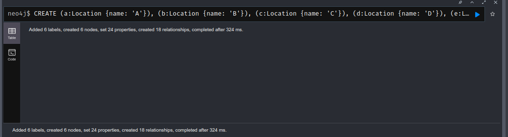
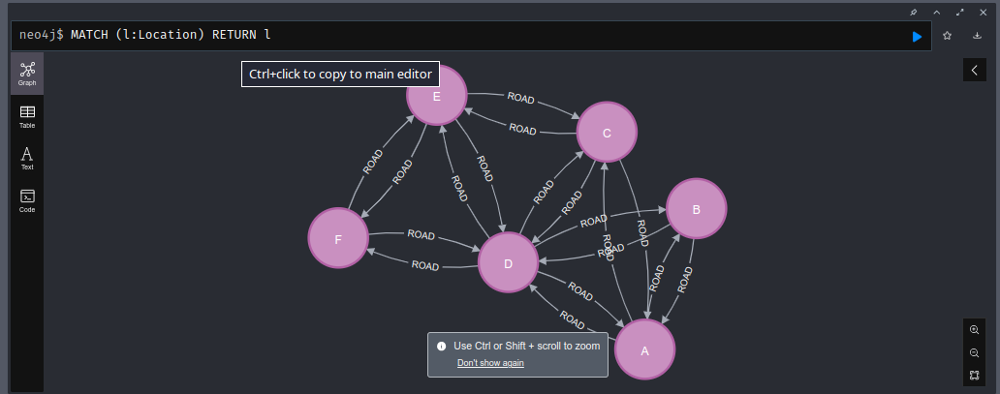
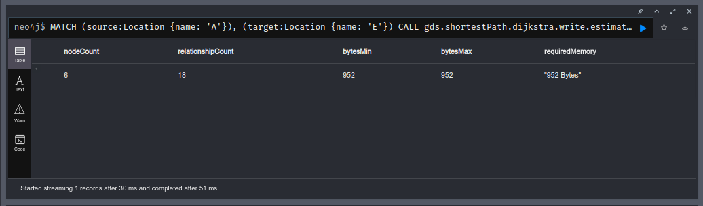
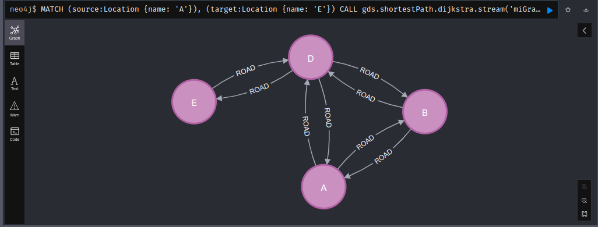
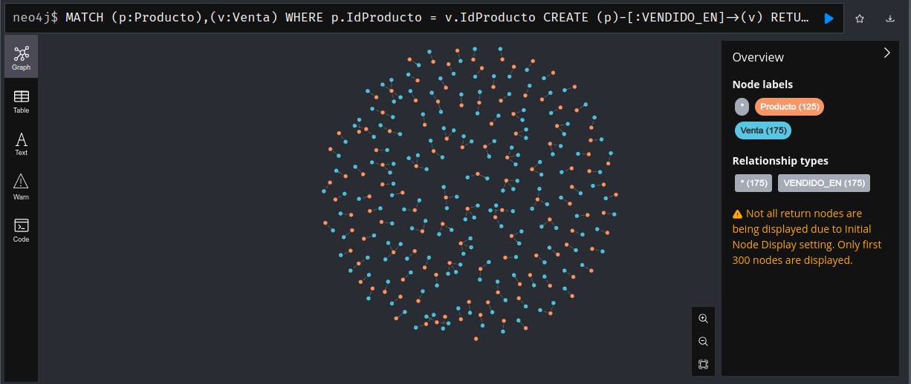
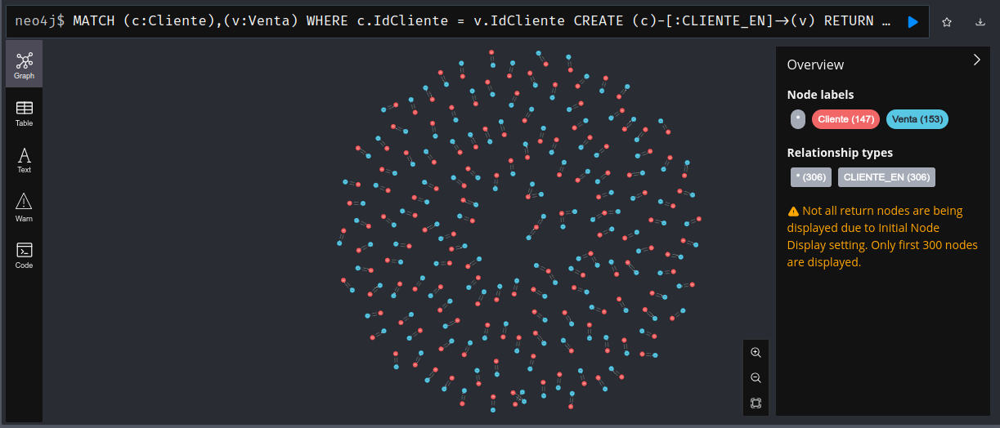

# 1) HDFS

Tamaño de bloque: 64 M

Número de réplicas: 3

En el archivo copiararchivos.sh se encuentra un script para copiar los archivo de a uno.

Pero investigando un poco con "sudo docker cp --help" en el material de ayuda menciona que sirve para copiar tanto archivos como directorios por lo que será más facil hacer:
[sudo docker cp _path del directorio Datasets_ namenode:/home]

sudo docker cp Datasets namenode:/home

El script hdfs_carpetas crea y copia los datos del Datasets a la carpeta /data de hdfs.

# 2) Hive

Para poder ejecutar el script primero debemos copiarlo al docker de hive.


# 3) Parquet particionado

Corregí el archivo.

# 4) Comprobando las diferencias en tiempo de procesamiento con o sin índices

## Consultas sin índices

1. select idsucursal, sum(precio * cantidad) from venta group by idsucursal;\
a. Time taken: 2.015 seconds, Fetched: 30 row(s)\
b. Time taken: 1.403 seconds, Fetched: 30 row(s)\
c. Time taken: 1.343 seconds, Fetched: 30 row(s)

2. select idcanal, sum(precio * cantidad) from venta group by idcanal;\
a. Time taken: 1.3 seconds, Fetched: 3 row(s)\
b. Time taken: 1.283 seconds, Fetched: 3 row(s)\
c. Time taken: 1.329 seconds, Fetched: 3 row(s)

## Consultas después de aplicar índices

1. select idsucursal, sum(precio * cantidad) from venta group by idsucursal;\
a. Time taken: 3.344 seconds, Fetched: 30 row(s)\
b. Time taken: 1.436 seconds, Fetched: 30 row(s)\
Time taken: 1.326 seconds, Fetched: 30 row(s)

2. select idcanal, sum(precio * cantidad) from venta group by idcanal;\
a. Time taken: 1.303 seconds, Fetched: 3 row(s)\
b. Time taken: 1.295 seconds, Fetched: 3 row(s)\
c. Time taken: 1.292 seconds, Fetched: 3 row(s)

# 5) Resultados
## 1. Hbase
```
hbase(main):016:0> get 'personal','4'\
COLUMN                         CELL                                                                                    
 personal_data:city            timestamp=1720379694571, value=Caracas                                                  
 personal_data:name            timestamp=1720379688067, value=Eliecer                                                  
2 row(s) in 0.0500 seconds
```

```
hbase(main):017:0> get 'album','label1'
COLUMN                         CELL                                                                                    
 image:name                    timestamp=1720381708228, value=holiday                                                  
 image:source                  timestamp=1720381717168, value=/tmp/pic1.jpg                                            
 label:color                   timestamp=1720381686388, value=255:255:255                                              
 label:size                    timestamp=1720381675750, value=10                                                       
 label:text                    timestamp=1720381695339, value=Family album                                             
5 row(s) in 0.0410 seconds
```
## 2. MongoDB
4.
```
dataprueba> show collections
iris_csv
iris_json
```
```
dataprueba> db.iris_csv.find()
[
  {
    _id: ObjectId('668af1be969356c1344a8700'),
    fila: 'fila1',
    sepal_length: 5.1,
    sepal_width: 3.5,
    petal_length: 1.4,
    petal_width: 0.2,
    species: 'setosa'
  },
  {
    _id: ObjectId('668af1be969356c1344a8701'),
    fila: 'fila2',
    sepal_length: 4.9,
    sepal_width: 3,
    petal_length: 1.4,
    petal_width: 0.2,
    species: 'setosa'
  },
  {
    _id: ObjectId('668af1be969356c1344a8702'),
    fila: 'fila3',
    sepal_length: 4.7,
    sepal_width: 3.2,
    petal_length: 1.3,
    petal_width: 0.2,
    species: 'setosa'
  },
  {
    _id: ObjectId('668af1be969356c1344a8703'),
    fila: 'fila5',
    sepal_length: 5,
    sepal_width: 3.6,
    petal_length: 1.4,
    petal_width: 0.2,
    species: 'setosa'
  },
  {
    _id: ObjectId('668af1be969356c1344a8704'),
    fila: 'fila4',
    sepal_length: 4.6,
    sepal_width: 3.1,
    petal_length: 1.5,
    petal_width: 0.2,
    species: 'setosa'
  },
  {
    _id: ObjectId('668af1be969356c1344a8705'),
    fila: 'fila9',
    sepal_length: 4.4,
    sepal_width: 2.9,
    petal_length: 1.4,
    petal_width: 0.2,
    species: 'setosa'
  },
  {
    _id: ObjectId('668af1be969356c1344a8706'),
    fila: 'fila8',
    sepal_length: 5,
    sepal_width: 3.4,
    petal_length: 1.5,
    petal_width: 0.2,
    species: 'setosa'
  },
  {
    _id: ObjectId('668af1be969356c1344a8707'),
    fila: 'fila10',
    sepal_length: 4.9,
    sepal_width: 3.1,
    petal_length: 1.5,
    petal_width: 0.1,
    species: 'setosa'
  },
  {
    _id: ObjectId('668af1be969356c1344a8708'),
    fila: 'fila11',
    sepal_length: 5.4,
    sepal_width: 3.7,
    petal_length: 1.5,
    petal_width: 0.2,
    species: 'setosa'
  },
  {
    _id: ObjectId('668af1be969356c1344a8709'),
    fila: 'fila12',
    sepal_length: 4.8,
    sepal_width: 3.4,
    petal_length: 1.6,
    petal_width: 0.2,
    species: 'setosa'
  },
  {
    _id: ObjectId('668af1be969356c1344a870a'),
    fila: 'fila13',
    sepal_length: 4.8,
    sepal_width: 3,
    petal_length: 1.4,
    petal_width: 0.1,
    species: 'setosa'
  },
  {
    _id: ObjectId('668af1be969356c1344a870b'),
    fila: 'fila14',
    sepal_length: 4.3,
    sepal_width: 3,
    petal_length: 1.1,
    petal_width: 0.1,
    species: 'setosa'
  },
  {
    _id: ObjectId('668af1be969356c1344a870c'),
    fila: 'fila6',
    sepal_length: 5.4,
    sepal_width: 3.9,
    petal_length: 1.7,
    petal_width: 0.4,
    species: 'setosa'
  },
  {
    _id: ObjectId('668af1be969356c1344a870d'),
    fila: 'fila7',
    sepal_length: 4.6,
    sepal_width: 3.4,
    petal_length: 1.4,
    petal_width: 0.3,
    species: 'setosa'
  },
  {
    _id: ObjectId('668af1be969356c1344a870e'),
    fila: 'fila17',
    sepal_length: 5.4,
    sepal_width: 3.9,
    petal_length: 1.3,
    petal_width: 0.4,
    species: 'setosa'
  },
  {
    _id: ObjectId('668af1be969356c1344a870f'),
    fila: 'fila18',
    sepal_length: 5.1,
    sepal_width: 3.5,
    petal_length: 1.4,
    petal_width: 0.3,
    species: 'setosa'
  },
  {
    _id: ObjectId('668af1be969356c1344a8710'),
    fila: 'fila15',
    sepal_length: 5.8,
    sepal_width: 4,
    petal_length: 1.2,
    petal_width: 0.2,
    species: 'setosa'
  },
  {
    _id: ObjectId('668af1be969356c1344a8711'),
    fila: 'fila19',
    sepal_length: 5.7,
    sepal_width: 3.8,
    petal_length: 1.7,
    petal_width: 0.3,
    species: 'setosa'
  },
  {
    _id: ObjectId('668af1be969356c1344a8712'),
    fila: 'fila20',
    sepal_length: 5.1,
    sepal_width: 3.8,
    petal_length: 1.5,
    petal_width: 0.3,
    species: 'setosa'
  },
  {
    _id: ObjectId('668af1be969356c1344a8713'),
    fila: 'fila21',
    sepal_length: 5.4,
    sepal_width: 3.4,
    petal_length: 1.7,
    petal_width: 0.2,
    species: 'setosa'
  }
]
Type "it" for more
```
```
dataprueba> db.iris_json.find()
[
  {
    _id: ObjectId('668af1c9bb851f5c2e2e5d99'),
    sepalLength: 5.1,
    sepalWidth: 3.5,
    petalLength: 1.4,
    petalWidth: 0.2,
    species: 'setosa'
  },
  {
    _id: ObjectId('668af1c9bb851f5c2e2e5d9a'),
    sepalLength: 4.6,
    sepalWidth: 3.1,
    petalLength: 1.5,
    petalWidth: 0.2,
    species: 'setosa'
  },
  {
    _id: ObjectId('668af1c9bb851f5c2e2e5d9b'),
    sepalLength: 4.9,
    sepalWidth: 3,
    petalLength: 1.4,
    petalWidth: 0.2,
    species: 'setosa'
  },
  {
    _id: ObjectId('668af1c9bb851f5c2e2e5d9c'),
    sepalLength: 5.4,
    sepalWidth: 3.9,
    petalLength: 1.7,
    petalWidth: 0.4,
    species: 'setosa'
  },
  {
    _id: ObjectId('668af1c9bb851f5c2e2e5d9d'),
    sepalLength: 5,
    sepalWidth: 3.6,
    petalLength: 1.4,
    petalWidth: 0.2,
    species: 'setosa'
  },
  {
    _id: ObjectId('668af1c9bb851f5c2e2e5d9e'),
    sepalLength: 4.6,
    sepalWidth: 3.4,
    petalLength: 1.4,
    petalWidth: 0.3,
    species: 'setosa'
  },
  {
    _id: ObjectId('668af1c9bb851f5c2e2e5d9f'),
    sepalLength: 5,
    sepalWidth: 3.4,
    petalLength: 1.5,
    petalWidth: 0.2,
    species: 'setosa'
  },
  {
    _id: ObjectId('668af1c9bb851f5c2e2e5da0'),
    sepalLength: 4.7,
    sepalWidth: 3.2,
    petalLength: 1.3,
    petalWidth: 0.2,
    species: 'setosa'
  },
  {
    _id: ObjectId('668af1c9bb851f5c2e2e5da1'),
    sepalLength: 4.4,
    sepalWidth: 2.9,
    petalLength: 1.4,
    petalWidth: 0.2,
    species: 'setosa'
  },
  {
    _id: ObjectId('668af1c9bb851f5c2e2e5da2'),
    sepalLength: 4.8,
    sepalWidth: 3,
    petalLength: 1.4,
    petalWidth: 0.1,
    species: 'setosa'
  },
  {
    _id: ObjectId('668af1c9bb851f5c2e2e5da3'),
    sepalLength: 4.3,
    sepalWidth: 3,
    petalLength: 1.1,
    petalWidth: 0.1,
    species: 'setosa'
  },
  {
    _id: ObjectId('668af1c9bb851f5c2e2e5da4'),
    sepalLength: 5.4,
    sepalWidth: 3.7,
    petalLength: 1.5,
    petalWidth: 0.2,
    species: 'setosa'
  },
  {
    _id: ObjectId('668af1c9bb851f5c2e2e5da5'),
    sepalLength: 5.8,
    sepalWidth: 4,
    petalLength: 1.2,
    petalWidth: 0.2,
    species: 'setosa'
  },
  {
    _id: ObjectId('668af1c9bb851f5c2e2e5da6'),
    sepalLength: 5.7,
    sepalWidth: 4.4,
    petalLength: 1.5,
    petalWidth: 0.4,
    species: 'setosa'
  },
  {
    _id: ObjectId('668af1c9bb851f5c2e2e5da7'),
    sepalLength: 5.4,
    sepalWidth: 3.9,
    petalLength: 1.3,
    petalWidth: 0.4,
    species: 'setosa'
  },
  {
    _id: ObjectId('668af1c9bb851f5c2e2e5da8'),
    sepalLength: 5.7,
    sepalWidth: 3.8,
    petalLength: 1.7,
    petalWidth: 0.3,
    species: 'setosa'
  },
  {
    _id: ObjectId('668af1c9bb851f5c2e2e5da9'),
    sepalLength: 5.1,
    sepalWidth: 3.5,
    petalLength: 1.4,
    petalWidth: 0.3,
    species: 'setosa'
  },
  {
    _id: ObjectId('668af1c9bb851f5c2e2e5daa'),
    sepalLength: 4.9,
    sepalWidth: 3.1,
    petalLength: 1.5,
    petalWidth: 0.1,
    species: 'setosa'
  },
  {
    _id: ObjectId('668af1c9bb851f5c2e2e5dab'),
    sepalLength: 5.4,
    sepalWidth: 3.4,
    petalLength: 1.7,
    petalWidth: 0.2,
    species: 'setosa'
  },
  {
    _id: ObjectId('668af1c9bb851f5c2e2e5dac'),
    sepalLength: 5.1,
    sepalWidth: 3.8,
    petalLength: 1.5,
    petalWidth: 0.3,
    species: 'setosa'
  }
]
Type "it" for more
```
5.
```
root@56e649442c15:/# mongoexport --db dataprueba --collection iris_csv --fields sepal_length,sepal_width,petal_length,petal_width,species --type=csv --out /data/iris_export.csv 
2024-07-07T20:09:51.546+0000	connected to: mongodb://localhost/
2024-07-07T20:09:51.555+0000	exported 150 records
```
```
root@56e649442c15:/# mongoexport --db dataprueba --collection iris_json --fields sepal_length,sepal_width,petal_length,petal_width,species --type=json --out /data/iris_export.json
2024-07-07T20:10:38.573+0000	connected to: mongodb://localhost/
2024-07-07T20:10:38.588+0000	exported 150 records
```
## 3. Neo4j













